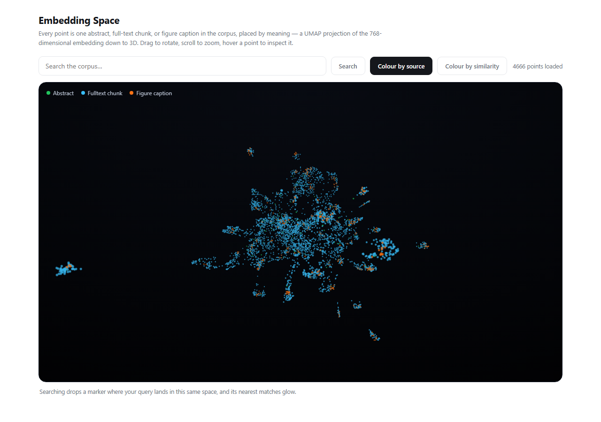
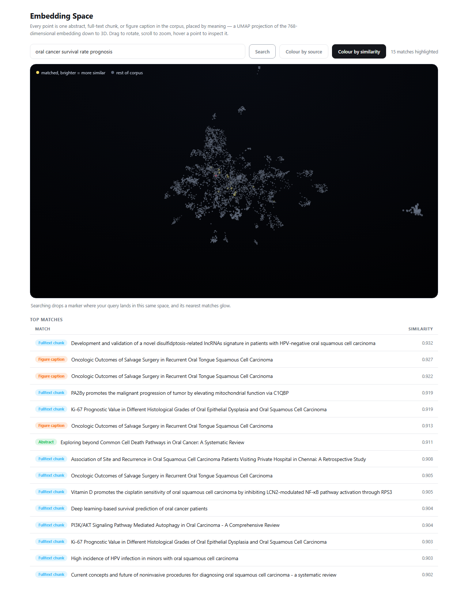

# Oral Cancer RAG

A retrieval-augmented generation system over peer-reviewed oral cancer research — abstracts, full-text papers, and figure captions, semantically searchable and grounded, with a live 3D map of the entire embedding space.

## Demo

**Every point is one abstract, full-text chunk, or figure caption in the corpus, placed by meaning** (a UMAP projection of the 768-dimensional embedding down to 3D). Drag to rotate, scroll to zoom, hover a point to inspect it.



Searching embeds your query with the same model used to build the corpus, drops a marker where it lands in that same space, and lights up its nearest neighbors — live, not precomputed:



Run it yourself at `/visualize` once the server is up (see [Setup](#setup)).

## What it does

1. Discovers and cleans oral cancer research papers from Semantic Scholar.
2. Downloads open-access PDFs and extracts full text and figure captions (matched to the actual rendered page image, not just a nearby page).
3. Embeds every abstract, full-text chunk, and figure caption with a PubMed-tuned sentence transformer and stores them in Postgres with `pgvector`.
4. Answers questions via `/query`: embeds the question, retrieves the closest passages by cosine similarity, and asks an LLM to answer grounded in the retrieved sources.
5. Lets you explore the whole corpus visually and interactively via `/visualize`.

## Architecture

```
ingestion/                      data-producing stages
├── fetch_papers.py             Semantic Scholar search → data/processed/oral_cancer_papers.json
├── clean_papers.py             dedupe + junk/off-topic filtering
├── finalize_papers.py          manual curation pass
├── download_pdfs.py            fetch open-access PDFs → data/pdfs/raw/
├── extract_fulltext.py         PDF → cleaned, chunked text → data/pdfs/extracted_text/
├── extract_visuals.py          PDF → rendered figure PNGs + captions, one pass so a
│                                caption can never be emitted without a real image
└── run_pipeline.py             orchestrates every stage in dependency order, resumable

embeddings/                     embedding + persistence
├── embedder.py                 single shared SentenceTransformer wrapper (used by every
│                                embed step AND the live query path — one model, one place)
├── embed_papers.py             abstracts → source='abstract'
├── embed_fulltext.py           full-text chunks → source='fulltext'
├── embed_captions.py           figure captions → source='figure_captions'
└── build_visualization.py      fits UMAP once on the full corpus, persists the model +
                                 a points/metadata manifest for the live 3D view

db/
├── models.py                   papers table (pgvector column, per-source unique index)
├── database.py                 SQLAlchemy engine + session
└── upsert.py                   shared batched upsert used by every embed_*.py step

app/                            FastAPI backend
├── main.py                     entrypoint, mounts routers + static images
├── retrieval.py                embeds a query, retrieves + dedupes top papers for chat
├── llm.py                      builds the grounded prompt, calls the LLM
├── visualize.py                projects a query into the persisted UMAP space,
│                                finds row-level nearest neighbors (no dedup — every
│                                chunk/caption is its own point)
└── viz_routes.py                /visualize, /visualize/manifest, /visualize/query

static/visualize.html           the 3D viewer — Three.js, no build step, no framework
```

## Setup

```bash
git clone <this-repo>
cd Oral-Cancer-X-AI-Integrated-Solution
python -m venv env && env\Scripts\activate      # or source env/bin/activate on Linux/Mac
pip install -r requirements.txt
```

Copy `.env.example` to `.env` and fill in your database and API credentials:

```bash
cp .env.example .env
```

Create the database (Postgres with the `pgvector` extension available) and the schema:

```bash
python -c "from db.models import create_tables; create_tables()"
```

Run the full ingestion pipeline (fetches papers, downloads PDFs, extracts text/figures, embeds everything, builds the 3D manifest):

```bash
python -m ingestion.run_pipeline
```

Each stage is independently resumable — re-run a single one with `--stage <name>` (e.g. `python -m ingestion.run_pipeline --stage extract_visuals`) without redoing everything before it.

Start the API:

```bash
uvicorn app.main:app --reload
```

- Chat: `POST http://localhost:8000/query` with `{"query": "..."}`
- 3D explorer: `http://localhost:8000/visualize`

## API reference

| Method | Path                  | Description                                                          |
|--------|-----------------------|-----------------------------------------------------------------------|
| GET    | `/health`             | Liveness check                                                        |
| POST   | `/query`              | Ask a question, get a grounded answer + cited sources                 |
| GET    | `/visualize`          | The 3D embedding-space viewer page                                    |
| GET    | `/visualize/manifest` | Precomputed points + metadata for the initial render                  |
| POST   | `/visualize/query`    | Embed a query, project it into the same 3D space, return matches      |

## Tech stack

Postgres + `pgvector` · SQLAlchemy · FastAPI · `sentence-transformers` (`pritamdeka/S-PubMedBert-MS-MARCO`) · PyMuPDF · UMAP · Three.js · Google Gemini (answer generation)

## Notes

- Figure-caption extraction structurally guarantees every caption has a real backing image — captions are only emitted for pages that were actually rendered, closing a class of bug where a caption's page number didn't match any image on disk.
- `db/models.py`'s schema is reproducible from an empty database: `create_tables()` produces the exact composite unique index (`paper_id`, `source`, `chunk_index`) the live data relies on.
- Answer generation currently runs on Gemini; a migration to Groq (already a project dependency, used elsewhere) is a planned follow-up, kept separate so it doesn't get tangled with pipeline/schema changes.
